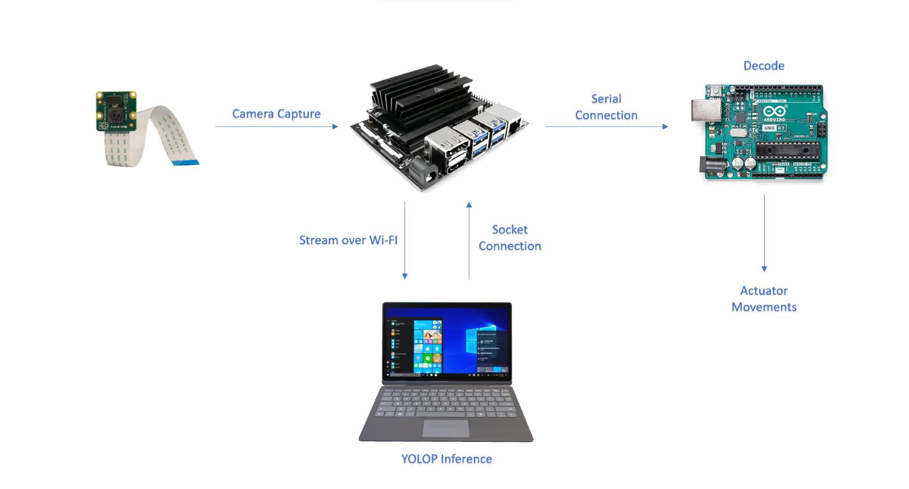

# YOLOP-to-autonomous-vehicle-prototype
An implementation of the YOLOP model into an autonomous vehicle prototype with lane-keeping and collision avoidance. Some file are cloned from [hustvl/yolop](https://github.com/noraasicnarf/YOLOP-to-autonomous-vehicle-prototype)
### Custom Trained Yolop
The network was trained on Nvidia Geforce RTX 3050. YOLOP inference was lowered down from 640 x 640 to 320 x 320 and added 13 class for Object Detection
### Prototype System Flow

To implement the described system, you'll need to have the Raspberry Pi Cam v2 (for capturing images), on the Host PC (for processing YOLOP inference), on the Jetson Nano (for communication with Raspberry Pi Camera and Host PC, and for sending commands to the Arduino), and on the Arduino (for controlling the DC motor based on received commands). Below, I'll provide a high-level overview of the steps involved and then outline the code for each component separately.
# Raspberry Pi Cam v2:

Capture images using the Raspberry Pi Camera V2.
Stream the images over Wi-Fi to the Host PC.
# Host PC:

Receive the streamed images from the Raspberry Pi.
Process the images using the YOLOP model for lane keeping.
Send the resulting commands (characters) back to the Jetson Nano.
# Jetson Nano:

Receive the commands from the Host PC.
Forward the commands to the Arduino via USB serial connection.
# Arduino:

Receive commands from the Jetson Nano via USB serial connection.
Interpret the commands and control the DC motor accordingly.

# How to Run:

To run the script, use the following command format in your terminal:

```bash
python demo.py [options]
```
**Important**: OpenCV should be built with GStreamer support to properly handle video streams from cameras.

### Available Arguments

- `--weights`: Path to the model weights file (default: `weights/epoch-140.pth`).
  - Example: `--weights weights/your_model.pth`
  
- `--source`: Input source, can be a file/folder or a camera device (default: `'0'`, which usually refers to the system's webcam).
  - Example: `--source 0` or `--source inference/images`
  
- `--img-size`: Inference image size in pixels (default: `320`).
  - Example: `--img-size 640`
  
- `--conf-thres`: Object confidence threshold (default: `0.5`).
  - Example: `--conf-thres 0.6`
  
- `--iou-thres`: Intersection over Union (IOU) threshold for Non-Maximum Suppression (default: `0.4`).
  - Example: `--iou-thres 0.5`
  
- `--device`: Device for computation, either CUDA (GPU) or CPU (default: `'0'` for CUDA device 0).
  - Example: `--device 0` or `--device cpu`
  
- `--save-dir`: Directory to save the inference results (default: `inference/output`).
  - Example: `--save-dir results/`

### Additional Network Camera Arguments

- `--ip`: IP address of the network camera (default: `'192.168.1.3'`).
  - Example: `--ip 192.168.1.100`
  
- `--camport`: Camera port (default: `5555`).
  - Example: `--camport 8080`
  
- `--udp_port`: UDP port (default: `8889`).
  - Example: `--udp_port 8890`

### Example Command

```bash
python tools/demo.py --weights weights/epoch-140.pth --source 0 --img-size 640 --conf-thres 0.6 --iou-thres 0.5 --device cpu --save-dir output/ --ip 192.168.1.100 --camport 8080 --udp_port 8890
```

### Prototype Sample Run


