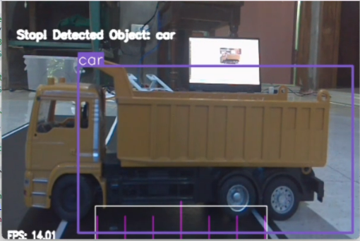
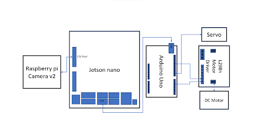

# YOLOP-to-autonomous-vehicle-prototype
An implementation of the YOLOP model into an autonomous vehicle prototype with lane-keeping and collision avoidance. Some file are cloned from [hustvl/yolop](https://github.com/noraasicnarf/YOLOP-to-autonomous-vehicle-prototype)
### Custom Trained Yolop
The network was trained on Nvidia Geforce RTX 3050. Yolop inference was lowered down from 640 x 640 to 320 x 320 and added 13 class for Object Detection
### Prototype System Flow

